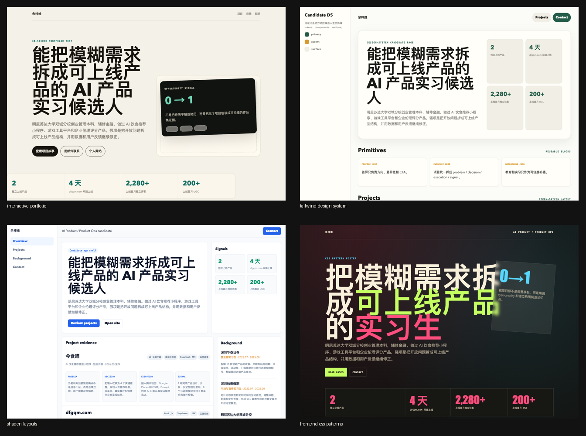
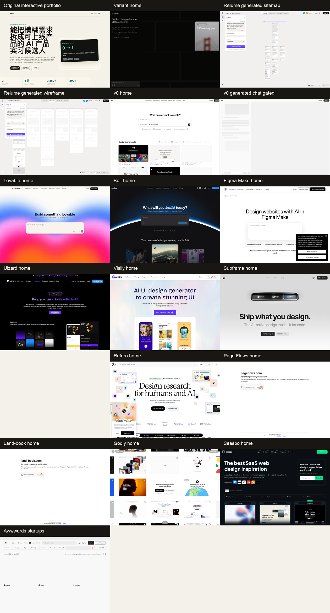

# 让 Codex 设计前端不丑：Skill、参考站点与重开发流程

这份手册整理这轮实验里所有关键原则：不同前端设计 Skill 的底层原理、Variant 这类外部设计工具的价值、参考库如何用、以及最重要的一步：让 Codex 先找类似站点，抽象设计语言，再重新开发。

一句话结论：**Codex 不应该被当成独立设计师，而应该被当成有浏览器和工程能力的前端实现者。设计方向要由 Skill、参考站点、设计系统和截图 QA 共同约束。**



## 为什么 Codex 直接设计会丑

Codex 直接收到“做一个好看的页面”时，通常会走向平均值：

- 居中大标题。
- 三列卡片。
- 紫蓝渐变。
- 默认字体。
- 大面积圆角卡片。
- 文案像模板。
- 只做桌面成功态，不做移动端、空状态、加载态、错误态。

这不是单个模型的问题，而是 prompt 过于空泛。模型没有真实设计目标、参考图、品牌约束和验收标准，只能回到训练集中最常见的 UI 形态。

所以正确做法不是继续说“再高级一点”，而是把设计问题拆开。

## 前端设计的六层问题

| 层级 | 要解决的问题 | 典型工具/Skill | 验收标准 |
| --- | --- | --- | --- |
| 叙事层 | 这个页面到底要表达什么 | `interactive-portfolio` | 30 秒内知道是谁、做什么、最强证明、如何联系 |
| 信息架构层 | 页面有哪些模块，先后顺序是什么 | Relume、`design-consultation` | 模块顺序支持用户决策，不堆字段 |
| 视觉方向层 | 页面看起来像哪类产品/品牌 | Variant、Godly、Land-book、`design-shotgun` | 有明确视觉立场，不像通用模板 |
| 设计系统层 | 颜色、字体、间距、组件如何复用 | `tailwind-design-system` | token 和组件统一，不散落硬编码 |
| 布局工程层 | 页面是否稳定、可滚动、响应式 | `shadcn-layouts` | 桌面/移动端都不崩，滚动区域正确 |
| 发布审查层 | 是否可信、不过界、没有隐私问题 | `claude-page-review`、Playwright | 不编造，不泄露，截图检查通过 |

只改 CSS，最多解决第三层的一部分。真正好看的前端，通常是六层都处理过。

## 1. Skill 的内部原理

### interactive-portfolio

底层原理：作品集不是简历网页化，而是一次机会转化。

它最适合个人网站、作品集、简历站。核心是 30 秒测试：

- 你是谁？
- 你做什么？
- 你最强的证明是什么？
- 我怎么联系你？

它要求项目优先于经历堆叠。项目不是列表，而是证据：问题、角色、过程、关键决策、结果、链接。

对 Offer-Compass 来说，`interactive-portfolio` 应该放在最前面，用来把简历从时间顺序改成证明顺序。

### frontend-design

底层原理：先决定视觉立场，再写代码。

它会逼 Codex 先选一个明确方向：编辑感、极简、工业风、奢华、玩具感、产品档案、战报、控制台。字体、颜色、背景、动效、空间都必须服务这个方向。

它解决的是“不要像普通 AI 模板”。

### design-taste-frontend

底层原理：LLM 生成 UI 有统计偏差，要用规则反向校准。

它会禁止或限制常见 AI 味：

- 紫蓝渐变。
- Inter/Arial/system 默认字体。
- 三列等宽卡片。
- 每段都套 card。
- 过强阴影和荧光。
- 只做成功态。
- 移动端高度和滚动没处理。

它像前端审美和工程质量 gate。

### design-shotgun

底层原理：早期不要在一个错误方向上微调，要先扩大搜索空间。

它适合一次生成多个真正不同的视觉方向。不是换按钮颜色，而是改信息结构、视觉密度、字体、页面节奏和情绪。

当用户说“不好看”“不是这个感觉”时，通常应该回到 `design-shotgun`，而不是继续局部调 CSS。

### design-consultation

底层原理：设计不是单页，而是一套可复用选择。

它适合定义模板家族、品牌气质、颜色系统、字体系统、间距节奏、模块规则。对于“上传简历生成个人网站”这种产品，它比一次性页面更重要。

### tailwind-design-system

底层原理：设计判断必须变成 token 和组件契约。

颜色、字体、间距、圆角、阴影、按钮、卡片、标签，都应该有单一事实源。否则每个生成页都会漂。

### shadcn-layouts

底层原理：CSS 布局来自约束链。

它解决的是页面会不会坏：

- `h-full` 有没有父级高度。
- flex 滚动子元素有没有 `min-h-0`。
- grid 子项有没有 grid 父级。
- ScrollArea 有没有明确高度。
- 侧栏、顶部栏、主内容区的 shrink/overflow 是否正确。

### frontend-css-patterns

底层原理：视觉语言由可复用 CSS 模式构成。

它补的是表达力：字体搭配、有限配色、错位构图、重叠、纹理、渐变、遮罩、动效节奏。它应该服务内容，不应该堆效果。

### landing-page-design

底层原理：页面服务转化。

首屏 5 秒要说清楚价值、证据和行动。它适合 Offer-Compass 的获客页、报告页、咨询预约页，但不应该直接套到候选人主页上，否则容易像销售页。

### claude-page-review

底层原理：Codex 控流程，Claude 做页面二次审查。

它适合上线前检查：

- 首屏是否清楚。
- 文案是否给用户看。
- 是否编造事实。
- 是否暴露隐私。
- 是否过度设计。

## 2. 外部站点怎么用



这次已经归档的截图包括：

- `assets/variant-home.png`：Variant 首页，用来理解 AI 视觉探索工具的产品表达。
- `assets/relume-generated-wireframe.png`：Relume 生成的 sitemap/wireframe，用来理解信息架构和线框价值。
- `assets/godly-home.png`：Godly 首页，用来找高审美网站方向。
- `assets/land-book-home.png`：Land-book 首页，用来找 landing page 和 section 参考。
- `assets/original-interactive-portfolio.png`：interactive-portfolio 方向的简历站效果。
- `assets/playbook-desktop.png`、`assets/playbook-mobile.png`：本手册页面的桌面/移动端验证截图。

### AI 设计/生成工具

| 网站 | 类型 | 我们实测结果 | 最适合用途 |
| --- | --- | --- | --- |
| Variant | AI 视觉探索 | 可打开，可输入 prompt，提交需登录 | 找多种视觉方向 |
| Figma Make | AI web design | 可打开，可输入 prompt，提交需登录 | Figma 内生成/调整设计 |
| v0 | AI app/code generator | 可输入 prompt，生成私有 chat，预览需登录态 | 登录后做代码生成 |
| Lovable | AI app builder | 可输入 prompt，提交需账号 | 应用原型生成 |
| Bolt | AI app builder | 可输入 prompt，提交需登录 | 应用原型生成 |
| Relume | sitemap/wireframe | 未登录生成 sitemap + wireframe | 信息架构和线框 |
| Uizard | AI UI generator | 生成器需登录 | UI mockup |
| Visily | AI UI generator | 生成器需登录 | UI mockup / screenshot to design |
| Subframe | code-first UI design | builder 需登录 | 设计系统和 code-first UI |

这类工具的正确定位：**不是生产依赖，而是参考输入和人工设计辅助。**

### 参考库

| 网站 | 价值 | 适合找什么 |
| --- | --- | --- |
| Godly | 高审美网站灵感 | 强视觉、反模板、作品集、AI 产品页 |
| Land-book | 网站/landing page 灵感 | 首屏、section、品牌页 |
| Saaspo | SaaS 网站参考 | 产品页、报告页、功能页 |
| Awwwards | 创意网站奖项 | 高冲击、实验性、视觉方向 |
| Mobbin | 真实产品 UI 截图 | 登录、上传、编辑、分享、dashboard |
| Page Flows | 用户流程 | onboarding、checkout、upload、search |
| Refero | Web/iOS UI 参考 | 页面模式和组件细节 |

参考库比 AI 生成器更稳定。对于 Codex，它们的价值是提供“真实世界的设计样本”，让 Codex 不要凭空想象。

## 3. Codex 先找类似站点，再重开发

这是最重要的工作流。

不要让 Codex 直接回答：

> 帮我做一个好看的简历网站。

应该让 Codex 先做参考研究：

> 先找 5 个同类高质量站点，截图首屏和关键 section，分析它们的信息架构、视觉语言、字体、颜色、组件、动效和移动端布局。不要抄袭，只抽象设计原则。然后基于这些原则重新设计并实现一个新页面。

### 具体步骤

1. 明确页面类型  
例如：候选人个人网站、SaaS landing page、报告页、AI copilot、dashboard、编辑器。

2. 找参考来源  
视觉方向用 Variant/Godly/Land-book/Awwwards。真实产品流程用 Mobbin/Page Flows/Refero。SaaS 产品页用 Saaspo/Land-book。

3. 截图并归档  
至少保存桌面首屏、关键 section、移动端首屏。没有截图，就没有设计参考。

4. 抽象而不是复制  
抽象这些信息：

- 信息顺序。
- 字体气质。
- 色彩关系。
- 留白密度。
- CTA 层级。
- 卡片/列表/时间线/作品展示模式。
- 移动端折叠方式。
- 动效节奏。

5. 生成设计 brief  
把参考站点的共性变成可执行 brief，不要说“像某某网站”，而是说：

- 左对齐 editorial hero。
- 单一强调色。
- 项目区用案例研究卡，不用普通三列 feature card。
- 首屏露出下一屏内容。
- 移动端 CTA 全宽。
- 不使用假 logo 和推荐语。

6. Codex 实现  
Codex 根据 brief、设计 token 和组件规则写代码。

7. Playwright QA  
打开真实页面，截桌面和移动端，检查：

- 文本是否溢出。
- CTA 是否可见。
- 图片是否加载。
- 滚动是否正确。
- 移动端是否一列且没有横向滚动。
- 动效是否影响性能。

8. 二次审查  
用 `claude-page-review` 或人工审查检查：文案、可信度、隐私、夸大、品牌一致性。

## 4. Codex 前端设计 Prompt 模板

### 参考研究 Prompt

```text
我要做一个 [页面类型]，目标用户是 [用户]，核心目标是 [目标]。

请先不要写代码。先搜索/打开 5 个高质量同类站点作为参考，保存截图，并从这些维度分析：
1. 首屏信息结构
2. 导航和 CTA
3. 字体气质
4. 色彩系统
5. section 顺序
6. 卡片/列表/图像使用方式
7. 移动端布局
8. 哪些设计可以抽象，哪些不能复制

最后输出一个新的设计 brief，再基于 brief 重新设计，不要直接抄任何站点。
```

### 实现 Prompt

```text
基于刚才的设计 brief 实现页面。

要求：
- 使用现有项目的真实源码入口，不改构建产物。
- 使用现有组件和 token；如果没有 token，先定义最小设计 token。
- 不使用默认 AI 风格：紫蓝渐变、三列卡片、Inter 默认、过多卡片。
- 所有内容来自给定事实，不编造客户、数据、推荐语、学校、公司、奖项。
- 桌面和移动端都要截图验证。
- 最终给出文件路径、测试结果、截图路径。
```

### 简历站 Prompt

```text
把这份简历做成个人网站时，先使用 interactive-portfolio 方法重组叙事。

目标不是把简历字段排版，而是让 HR/内推人 30 秒内知道：
1. 这个人是谁
2. 适合什么岗位
3. 最强项目证明是什么
4. 有哪些真实结果
5. 如何联系

先输出候选人定位、项目证明排序、页面结构和隐私处理方案，再开始设计。
```

## 5. 对 Offer-Compass 的最终流程

对于“用户上传简历，立刻生成个人网站”，推荐产品链路是：

1. 简历解析  
抽取事实，不生成设计。

2. 叙事重组  
使用 `interactive-portfolio`：定位、强项目、结果、CTA。

3. 模板家族选择  
产品/运营、研发/算法、金融/咨询、设计/内容、创业/项目型。

4. 参考选择  
每个模板家族绑定 3-5 个参考截图和设计 brief。

5. 设计系统生成  
`tailwind-design-system` 固化 token 和组件。

6. 页面实现  
Codex 按参考和 token 实现。

7. 布局校验  
`shadcn-layouts` 检查高度、滚动、响应式。

8. 截图 QA  
Playwright 桌面/移动端截图。

9. 内容真实性和隐私检查  
禁止假数据、假推荐语、假 logo、私密联系方式泄露。

10. 发布前审查  
`claude-page-review` 或人工二次审查。

## 6. 质量检查清单

### 设计前

- 页面类型明确了吗？
- 目标用户明确了吗？
- 首屏最重要信息明确了吗？
- 有 3-5 个参考站点截图吗？
- 参考站点只抽象原则，没有直接复制吗？

### 设计中

- 是否先处理叙事和结构，再处理视觉？
- 是否避免默认 AI 风？
- 是否有 token 和组件规则？
- 是否考虑移动端？
- 是否有 loading/empty/error/active 状态？

### 发布前

- 是否截图检查桌面和移动端？
- 是否没有横向滚动？
- 是否没有文本溢出？
- 是否没有假指标、假客户、假推荐语？
- 是否没有泄露隐私？
- 是否有明确 CTA？

## 7. 附录：可直接复用的内容

这一节放执行时最有价值、但不适合塞进正文的内容。后续让 Codex 做前端时，可以直接复制这些表格和模板。

### A0. Skill 下载/复制地址索引

Codex Skill 的通用原则：一个 Skill 通常就是一个包含 `SKILL.md` 的目录。外部用户如果要安装，可以参考 OpenAI Codex Skills 官方文档：

- OpenAI Codex Skills 文档：https://developers.openai.com/codex/skills
- OpenAI Skills Catalog：https://github.com/openai/skills

这次用到的 Skill 地址如下：

| Skill | 公开来源/下载地址 | 推荐安装路径 | 说明 |
| --- | --- | --- | --- |
| `interactive-portfolio` | https://github.com/vibeforge1111/vibeship-spawner-skills/tree/main/maker/interactive-portfolio | `~/.agents/skills/interactive-portfolio/` | 明确来自 VibeShip Spawner Skills，适合简历站/作品集叙事 |
| `design-shotgun` | https://github.com/garrytan/gstack/tree/main/design-shotgun | `~/.agents/skills/gstack/design-shotgun/` | gstack Skill，用于多方向视觉探索 |
| `design-consultation` | https://github.com/garrytan/gstack/tree/main/design-consultation | `~/.agents/skills/gstack/design-consultation/` | gstack Skill，用于设计系统和品牌方向 |
| `frontend-design` | 未确认公开仓库；可按下方行为说明复现 | `~/.agents/skills/frontend-design/` | 高质量前端页面生成 |
| `design-taste-frontend` | 未确认公开仓库；可按下方行为说明复现 | `~/.agents/skills/design-taste-frontend/` | 反 AI 味和审美校准 |
| `frontend-css-patterns` | 未确认公开仓库；可按下方行为说明复现 | `~/.agents/skills/frontend-css-patterns/` | CSS 视觉模式 |
| `tailwind-design-system` | 未确认公开仓库；可按下方行为说明复现 | `~/.agents/skills/tailwind-design-system/` | token 和组件系统 |
| `shadcn-layouts` | 未确认公开仓库；可按下方行为说明复现 | `~/.agents/skills/shadcn-layouts/` | shadcn/Tailwind 布局稳定性 |
| `landing-page-design` | https://raw.githubusercontent.com/inference-sh/skills/refs/heads/main/cli-install.md | `~/.agents/skills/landing-page-design/` | Skill 内部标注依赖 inference.sh CLI 安装说明 |
| `claude-page-review` | 未确认公开仓库；可按下方行为说明复现 | `~/.codex/skills/claude-page-review/` | Claude 二次页面审查 |
| `remote-codex-worker` | 未确认公开仓库；仅适合有远程 Codex worker 的团队 | `~/.codex/skills/remote-codex-worker/` | 把指定远程项目任务交给远端 Codex worker |

没有公开源码的 Skill 不应该只写“本地可用”。读者至少需要知道它解决什么问题、接收什么输入、会产出什么结果。下面是这次实验用到的行为摘要；即使没有这些 Skill 的源码，也可以把对应描述复制给 Codex，让它按同样流程执行。

| Skill | 解决的问题 | 典型输入 | 典型产出 |
| --- | --- | --- | --- |
| `interactive-portfolio` | 把简历从经历顺序改成机会转化页，确保 30 秒内看懂是谁、做什么、最强证明和联系方式。 | 简历、目标岗位、作品链接、隐私边界。 | 候选人定位、首屏叙事、项目证据排序、联系 CTA。 |
| `frontend-design` | 逼模型先选明确视觉方向，再实现有记忆点的页面，避免通用模板感。 | 页面目标、受众、品牌气质、技术栈、参考图。 | 独特视觉方向、字体/色彩/空间策略、可运行前端代码。 |
| `design-taste-frontend` | 用规则反向校准 LLM 常见偏差，如紫蓝渐变、三列卡片、默认字体、静态成功态。 | 已有页面或待实现页面、期望密度、动效强度、技术约束。 | 审美修正清单、组件/布局规则、响应式和交互状态要求。 |
| `design-shotgun` | 在视觉方向不确定时一次生成多套差异明显的方案，先选方向再深化。 | 产品/页面 brief、目标用户、可接受和不可接受的风格。 | 3-5 个视觉方向、对比板、反馈问题、下一轮收敛建议。 |
| `design-consultation` | 为新项目建立设计系统源头，而不是边写边散落颜色和组件规则。 | 产品定位、竞品、品牌关键词、页面类型、已有约束。 | `DESIGN.md`、字体/颜色/间距/动效系统、预览页面。 |
| `tailwind-design-system` | 把视觉方向落成 Tailwind/shadcn 可复用 token 和组件 primitive。 | 设计方向、Tailwind 版本、shadcn 使用范围、主题需求。 | CSS 变量、Tailwind theme、封装后的 Button/Card/Input 等基础组件。 |
| `shadcn-layouts` | 修正 app shell、flex/grid、高度链和滚动容器问题，让布局稳定。 | shadcn/Tailwind 页面、滚动问题、全屏布局或 dashboard 结构。 | 高度链规则、`min-h-0`/`min-w-0` 修复、稳定的 shell/grid 布局。 |
| `frontend-css-patterns` | 提供框架无关的 CSS 写法，覆盖字体、色彩、动效、背景纹理和空间组合。 | 设计 token、页面气质、CSS 或 Tailwind 约束。 | CSS custom properties、排版尺度、色彩主题、动画和视觉细节模式。 |
| `landing-page-design` | 优化 landing page 的首屏、CTA、信任证据和转化路径。 | 产品价值、目标用户、转化目标、社会证明、hero image 需求。 | 5 秒首屏公式、标题/副标题、CTA、社会证明和 section 顺序。 |
| `claude-page-review` | 发布前用第二模型审查用户可见页面，重点看文案、层级、真实性和隐私。 | 页面链接或源码、业务目标、不能暴露的信息、允许修改范围。 | 页面问题清单、改稿 brief、二次审查建议、发布前检查结果。 |
| `remote-codex-worker` | 把任务交给远端 Codex worker，在远程项目目录内继续开发、验证、提交。 | 远程项目标识、任务描述、权限边界、期望验证方式。 | 远程会话状态、执行结果、提交/PR/部署反馈。 |

如果要把未公开 Skill 分享给外部用户，最稳妥的做法是：

```bash
# 复制某个 Skill 到对方 Codex 技能目录
mkdir -p ~/.codex/skills
cp -R /path/to/skill-folder ~/.codex/skills/<skill-name>

# 或者复制到通用 agent 技能目录
mkdir -p ~/.agents/skills
cp -R /path/to/skill-folder ~/.agents/skills/<skill-name>
```

发布给更多人时，建议把每个 Skill 放到公开 GitHub 仓库中，并保留 `SKILL.md`、依赖脚本、模板、示例和 license。不要只复制 prompt 文本，否则 Skill 的资源、脚本和例子会丢失。

### A1. 外部设计工具和参考站点地址

| 名称 | 地址 | 类型 | 本文里的用途 |
| --- | --- | --- | --- |
| Variant | https://variant.com/ | AI 视觉探索 | 找页面气质和视觉方向 |
| Figma Make | https://www.figma.com/make/ | AI 设计工具 | 在 Figma 生态内生成/调整页面 |
| v0 | https://v0.app/ | AI app/code generator | 登录后生成组件或应用原型 |
| Lovable | https://lovable.dev/ | AI app builder | 快速生成应用原型 |
| Bolt | https://bolt.new/ | AI app builder | 快速生成前端项目 |
| Relume | https://www.relume.io/ | sitemap/wireframe | 信息架构、页面结构、线框 |
| Uizard | https://uizard.io/ | AI UI generator | UI mockup / wireframe |
| Visily | https://www.visily.ai/ | AI UI generator | UI mockup / screenshot to design |
| Subframe | https://www.subframe.com/ | code-first UI design | 设计系统和后台 UI |
| Godly | https://godly.website/ | 高审美网站灵感 | 强视觉、反模板、作品集/AI 产品参考 |
| Land-book | https://land-book.com/ | landing page 灵感 | 首屏、section、品牌页 |
| Saaspo | https://saaspo.com/ | SaaS 网站参考 | 产品页、功能页、报告页 |
| Awwwards | https://www.awwwards.com/ | 创意网站奖项 | 高冲击、实验性视觉方向 |
| Mobbin | https://mobbin.com/ | 真实产品 UI 截图 | 登录、上传、编辑、分享、dashboard |
| Page Flows | https://pageflows.com/ | 用户流程参考 | onboarding、checkout、upload、search |
| Refero | https://refero.design/ | Web/iOS UI 参考 | 页面模式和组件细节 |

### A. Skill 选择矩阵

| 页面目标 | 第一优先 Skill | 搭配 Skill | 关键产出 |
| --- | --- | --- | --- |
| 简历生成个人网站 | `interactive-portfolio` | `tailwind-design-system`、`claude-page-review` | 候选人定位、项目证明排序、CTA、隐私处理 |
| 获客 landing page | `landing-page-design` | `frontend-design`、`design-review` | 首屏价值、信任证据、转化路径 |
| 找视觉方向 | `design-shotgun` | `design-taste-frontend` | 3-5 个差异明显的方向，不在坏方向上微调 |
| 沉淀模板系统 | `design-consultation` | `tailwind-design-system`、`shadcn-layouts` | 模板家族、token、组件规则、响应式规则 |
| 改已有页面审美 | `design-taste-frontend` | `frontend-css-patterns`、Playwright | 去 AI 味、提升排版密度、截图对比 |
| 做后台/工具页 | `shadcn-layouts` | `frontend-patterns`、`design-review` | app shell、滚动区域、状态和表单布局 |
| 发布前把关 | `claude-page-review` | Playwright | 首屏清晰度、真实性、隐私、移动端截图 |

### B. 参考站点用途速查

| 类型 | 站点 | 适合借鉴 | 不适合做什么 |
| --- | --- | --- | --- |
| AI 视觉探索 | Variant | 找页面气质、首屏风格、组件组合方向 | 不要直接当生产代码来源 |
| 信息架构 | Relume | sitemap、wireframe、section 顺序 | 不要相信它生成的人名、公司、指标 |
| 代码生成 | v0、Lovable、Bolt | 登录后快速生成 app 原型或组件 | 不要跳过源码审查和响应式 QA |
| 设计系统 | Subframe | code-first UI、组件系统、后台页面 | 不要让它替代业务信息架构 |
| 高审美灵感 | Godly、Awwwards | 视觉语言、动效、排版张力 | 不要复制独特品牌资产 |
| Landing 参考 | Land-book、Saaspo | 首屏、CTA、section、SaaS 叙事 | 不要把个人主页做成硬销售页 |
| 真实产品流程 | Mobbin、Page Flows、Refero | 上传、登录、编辑、分享、dashboard 流程 | 不要只看单屏，忽略完整用户路径 |

### C. 截图研究表

每次让 Codex 参考外部站点时，至少填这张表。没有截图和抽象，就不算完成设计研究。

| 参考站点 | 截图路径 | 可抽象的设计原则 | 不能复制的内容 | 对本页面的改造动作 |
| --- | --- | --- | --- | --- |
| 站点 A | `assets/ref-a-hero.png` | 左对齐 hero、强标题、低饱和强调色 | logo、品牌图、专属插画 | 用相同信息层级，不复刻视觉资产 |
| 站点 B | `assets/ref-b-mobile.png` | 移动端 CTA 全宽，首屏露出下一节 | 具体文案、客户 logo | 改移动端结构和 CTA 位置 |
| 站点 C | `assets/ref-c-section.png` | 项目用 case study，不用三列 feature card | 项目图片和数据 | 把简历项目重写为问题-动作-结果 |

### D. 设计 brief 模板

```text
页面类型：
目标用户：
页面主目标：
首屏必须回答：
- 
- 
- 

参考来源：
- 参考 1：截图路径 / 可抽象原则
- 参考 2：截图路径 / 可抽象原则
- 参考 3：截图路径 / 可抽象原则

信息架构：
1. Hero：
2. Proof：
3. Case studies：
4. Background：
5. CTA：

视觉语言：
- 字体：
- 主色：
- 强调色：
- 背景：
- 图片/截图：
- 动效：

组件规则：
- Button：
- Card：
- Tag：
- Timeline：
- Mobile：

禁止项：
- 不编造数据、客户、推荐语、学校、公司和奖项。
- 不使用紫蓝渐变、默认三列卡片、过度圆角、过强阴影。
- 不复制参考站点的 logo、插画、摄影、专属文案。

验收：
- 桌面截图：
- 移动端截图：
- 无横向滚动：
- CTA 可点击：
- 隐私字段已处理：
```

### E. 反 AI 味检查表

| 常见问题 | 判断方式 | 修正动作 |
| --- | --- | --- |
| 紫蓝渐变和发光背景 | 页面第一眼像通用 AI SaaS 模板 | 换成品牌色、真实图片、纸面/编辑/产品系统语言 |
| 三列卡片堆满页面 | 每个 section 都是 3 cards | 改为 case study、列表、时间线、对比表、截图说明 |
| 文案空泛 | “提升效率”“打造体验”“赋能未来”太多 | 换成具体对象、动作、证据、结果 |
| 字体无气质 | 全站 system font，字号只靠 clamp 放大 | 建立标题/正文/数字/标签的字体层级 |
| 页面没有真实资产 | 只有色块、图标、抽象背景 | 加入产品截图、作品截图、报告图、真实站点参考图 |
| 移动端只是缩小 | 表格溢出、按钮挤压、hero 太高 | 单列重排、CTA 全宽、长表横滚或拆卡片 |
| 缺少状态 | 只做最终成功页 | 补 loading、empty、error、active、disabled 状态 |

### F. Offer-Compass 简历站模板家族

| 候选人类型 | 推荐结构 | 视觉方向 | 风险 |
| --- | --- | --- | --- |
| 产品/运营 | 定位 + 项目 case + 增长证据 + 方法论 | 编辑感、产品档案、轻 dashboard | 容易写成空泛产品话术 |
| 研发/算法 | 技术栈 + 项目架构 + 性能/指标 + GitHub/论文 | 技术档案、控制台、代码注释感 | 容易过黑客风，HR 看不懂 |
| 数据分析 | 问题 + 数据方法 + 图表 + 决策影响 | 数据报告、insight dashboard | 容易图表装饰化 |
| 金融/咨询 | 教育背景 + 案例拆解 + 行业理解 + 输出物 | 克制、高密度、研究报告感 | 容易过度保守没有记忆点 |
| 设计/内容 | 作品封面 + 过程 + 风格 + 传播结果 | 画廊、杂志、作品集 | 容易只好看，没有业务结果 |
| 创业/项目型 | 机会判断 + 从 0 到 1 + 真实用户/数据 + 迭代 | founder memo、launch page | 容易夸大，必须反幻觉 |

### G. 一条完整的 Codex 指令

```text
你现在要为 Offer-Compass 生成一个候选人个人网站。

先不要写代码。按下面顺序执行：
1. 用 interactive-portfolio 方法重组简历叙事，输出候选人定位、最强 3 个证明、隐私处理方案。
2. 找 5 个同类高质量参考站点或参考库页面，保存桌面和移动端截图。
3. 分析参考站点的信息架构、字体、颜色、CTA、section 顺序、移动端布局。
4. 把参考抽象成新的 design brief，不复制任何站点资产。
5. 选择模板家族，并定义 token、组件、响应式规则。
6. 只修改真实源码入口，不改构建产物。
7. 实现后用 Playwright 截桌面和移动端。
8. 检查是否有假数据、隐私泄露、横向滚动、图片加载失败、CTA 不可点击。
9. 最后给出文件路径、截图路径、验证结果和剩余风险。
```

## 8. 这次实验的直接结论

最值得保留的不是某一个外部工具，而是这个流程：

> 参考站点给方向，Skill 给原则，Codex 做实现，Playwright 做视觉验收，Claude/人工做发布审查。

Codex 不是不能设计前端。Codex 不能在没有方向、没有参考、没有设计系统、没有截图验收的情况下稳定设计好前端。

让 Codex 先找类似站点，再抽象设计语言，再重新开发，是目前最实际的解法。
