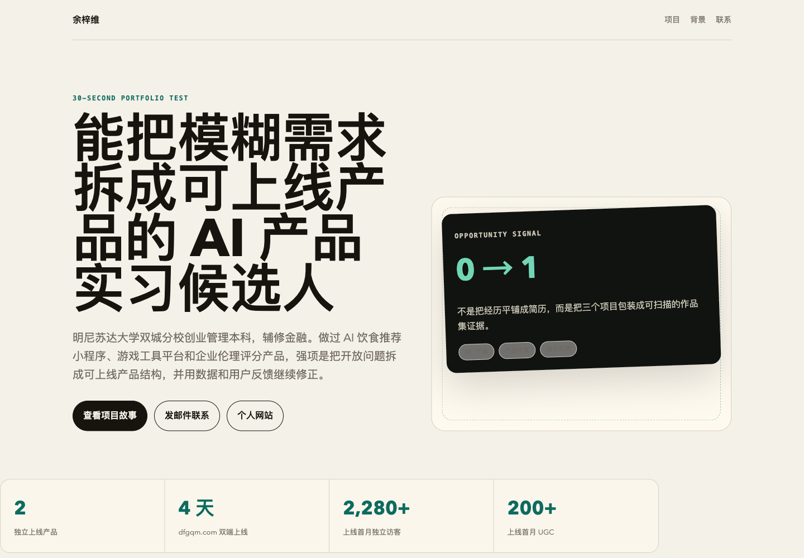
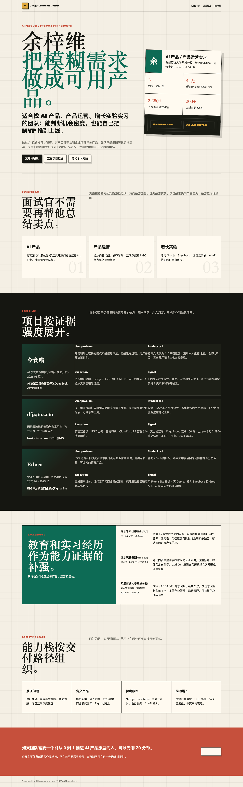
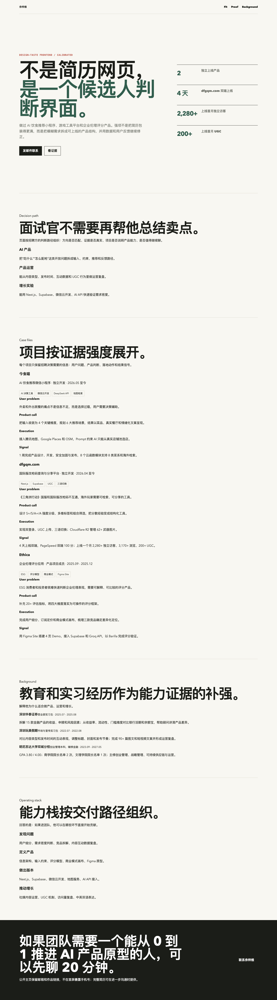
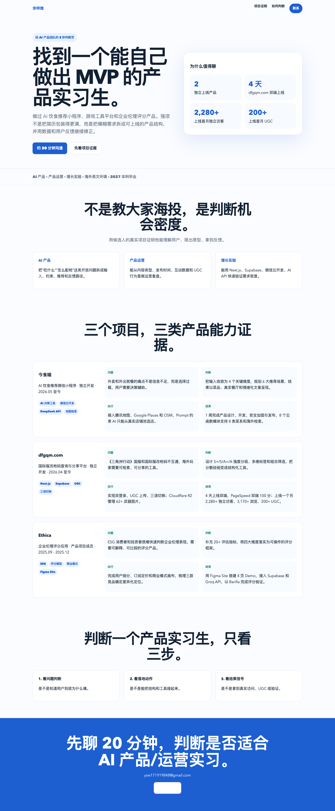
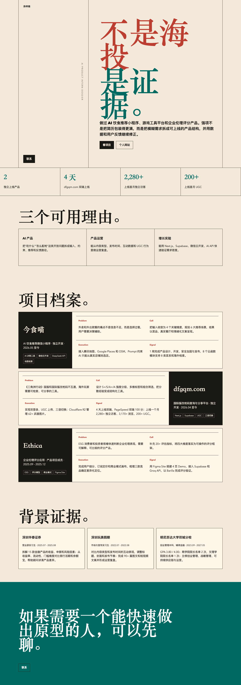
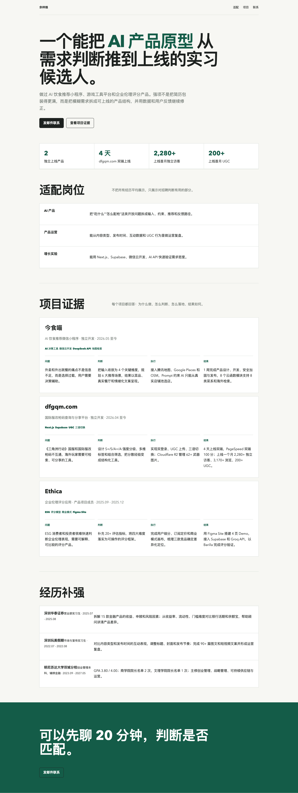
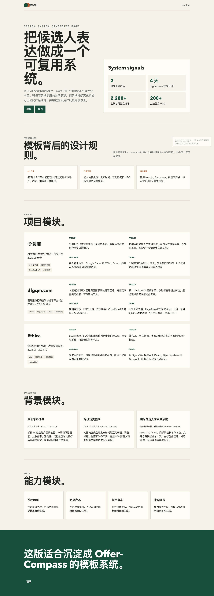
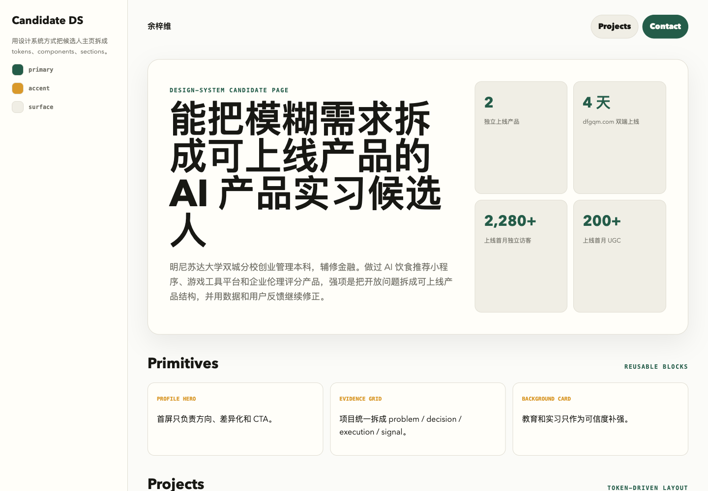
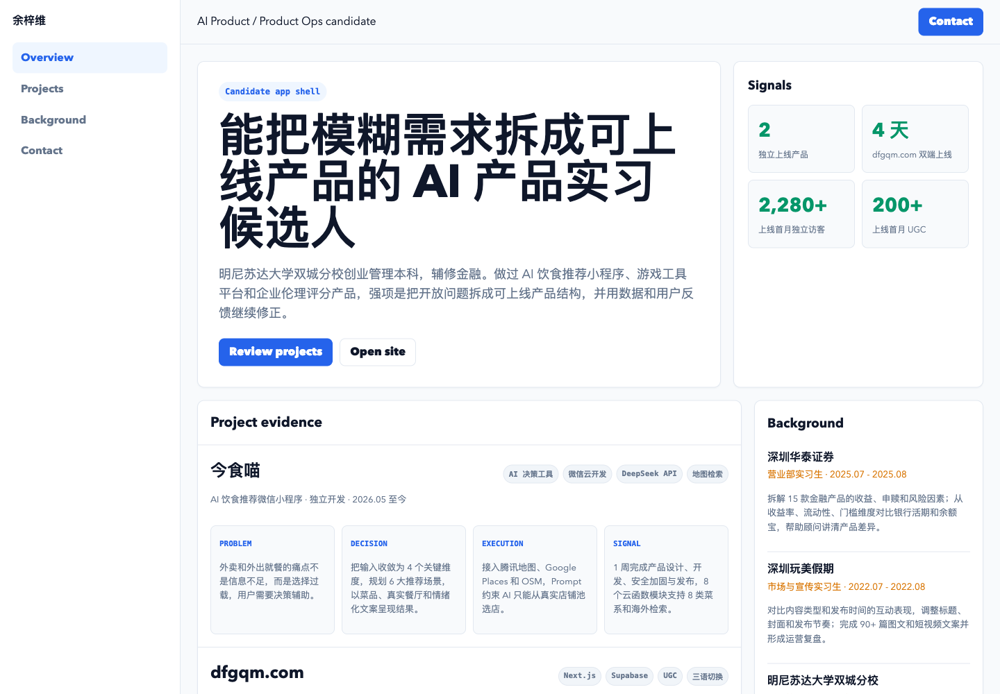
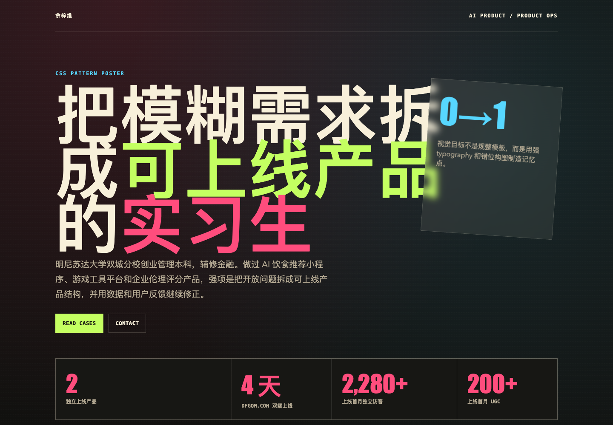

# 这些前端设计 Skill 的底层原理

这轮测试里，我们不是在找“哪个 Skill 最好看”。更准确地说，我们是在拆每个 Skill 背后的设计模型：它默认认为前端设计最难的部分是什么，它会优先修正什么，它适合放在产品流程的哪一步。

同一份简历生成了多套页面之后，一个结论很清楚：页面不好看，通常不是 CSS 写少了，而是设计问题没有被正确分层。

有的 Skill 解决“候选人如何被记住”，有的解决“用户为什么要点下一步”，有的解决“页面如何不崩”，有的解决“怎么把一次设计变成可复用模板”。这些不是同一个问题。

## 先给结论

如果 Offer-Compass 要做“上传简历，自动生成个人网站”，不能只用一个前端设计 Skill。更合理的组合是：

- `interactive-portfolio` 负责候选人叙事和作品证明。
- `design-consultation` 负责定义模板家族和设计系统。
- `design-shotgun` 负责早期拉开多个视觉方向。
- `frontend-design` 负责做出有记忆点的首版高质量页面。
- `design-taste-frontend` 负责去掉 AI 味和廉价模板感。
- `tailwind-design-system` 负责把视觉变成可复用 token 和组件。
- `shadcn-layouts` 负责页面布局、滚动、高度、响应式不出错。
- `frontend-css-patterns` 负责补足独特的 CSS 视觉语言。
- `landing-page-design` 负责获客页和转化页。
- `claude-page-review` 负责发布前的二次审查。

换句话说，简历网站生成器的核心不是“生成一个 HTML”，而是搭一条设计流水线：先判断候选人怎么表达，再选择模板，再用设计系统生成页面，最后做发布前审查。

## 一张总表

| Skill | 底层问题 | 核心原理 | 最适合场景 | 最大风险 |
| --- | --- | --- | --- | --- |
| `interactive-portfolio` | 候选人如何在 30 秒内被理解和记住 | 项目证明大于履历罗列，作品集是转化工具 | 个人网站、作品集、求职主页 | 只讲视觉，不讲真实影响 |
| `frontend-design` | 如何避免普通 AI 模板感 | 先选强视觉方向，再让字体、颜色、空间、动效服务这个方向 | 创意页、品牌页、高识别度页面 | 视觉强但业务叙事弱 |
| `design-taste-frontend` | 如何把 AI 页面校准成高级前端 | 用约束修正常见 LLM UI 偏差 | 页面美化、审美升级、反模板化 | 不能自动解决产品定位 |
| `landing-page-design` | 用户为什么要继续行动 | 首屏价值、证据、CTA、转化路径 | 获客页、服务页、咨询预约页 | 个人主页容易变得太销售 |
| `design-shotgun` | 方向没定时如何探索 | 一次生成多个真正不同的方向 | 早期视觉探索、用户不满意时重开方向 | 探索稿不能直接上线 |
| `claude-page-review` | 发布前页面是否可信、清晰、不过界 | Codex 控流程，Claude 做页面二次审查 | 公共页面、Hero、文案、品牌页上线前 | 如果 brief 不清，审查会泛化 |
| `design-consultation` | 如何从单页变成体系 | 先定义设计系统，再落页面 | 模板库、品牌系统、多页面产品 | 可能不如创意型 Skill 惊艳 |
| `tailwind-design-system` | 如何让设计可复用 | token 是单一事实源，组件包住自由度 | 产品工程、模板系统、长期维护 | 前期约束多，速度慢一点 |
| `shadcn-layouts` | 为什么页面会滚动错、撑破、塌陷 | CSS 布局来自约束链 | App shell、仪表盘、滚动布局 | 它解决正确性，不解决审美 |
| `frontend-css-patterns` | 如何形成独特 CSS 视觉语言 | 字体、配色、动效、空间、纹理是可复用模式 | 静态页、海报页、视觉增强 | 容易堆效果，压过内容 |

## 1. interactive-portfolio：把简历变成机会转化页

`interactive-portfolio` 的底层判断是：作品集不是简历的网页版本，而是一次 30 秒的机会转化。

它关心的第一件事不是页面多漂亮，而是访问者能不能快速回答四个问题：

- 你是谁？
- 你做什么？
- 你最强的证明是什么？
- 我如何联系你？

这就是它的 30 秒测试。

这套 Skill 的关键，不是“放项目卡片”，而是重构候选人叙事。传统简历喜欢把经历按时间顺序堆出来，但作品集要按“证明力”排序。最有说服力的项目、真实数据、上线结果、用户反馈，应该先出现。

所以它会特别强调项目展示：

- 项目不是经历列表，而是能力证据。
- 项目卡需要视觉钩子、标题、一句话说明、标签、结果。
- 详情页需要讲 challenge、role、process、decision、result。
- “我做过什么”不够，要变成“我解决了什么问题，结果如何”。

这对 Offer-Compass 很关键。因为简历转网站的最大难点，不是把 PDF 变成网页，而是把候选人的经历改写成更容易被雇主理解的证据链。

适合放在流程的第一步：抽取候选人定位、项目证明、可展示成果。

## 2. frontend-design：先决定视觉立场

`frontend-design` 的底层原则是：一个页面必须先有明确的审美立场，否则再多 CSS 也只是装饰。

它反对的不是简单，而是没有态度的默认值。默认字体、默认卡片、默认紫蓝渐变、默认三列布局，这些东西会让页面看起来像任何一个 AI 生成页面。

它的工作方式是先问：

- 这个页面的语气是什么？
- 它要给人什么第一印象？
- 有没有一个能被记住的视觉锚点？
- 字体、色彩、空间、动效是否都服务同一个概念？

这类 Skill 擅长把页面从“可用”拉到“有识别度”。比如把一份产品实习简历做成候选人档案、创业者 dossier、项目战报、个人品牌页，而不是普通简历网页。

但它也有边界。视觉方向强，不等于业务表达对。如果输入的候选人定位不清，它可能会把错误的故事讲得很好看。

适合放在“已确定叙事后”的视觉首版阶段。

## 3. design-taste-frontend：把审美变成工程约束

`design-taste-frontend` 的价值在于它不是泛泛地说“做高级一点”，而是把常见的 AI 前端坏习惯变成可执行的反向规则。

它的底层原理是：LLM 生成 UI 有统计偏差，所以必须用明确约束去抵消。

典型偏差包括：

- 总喜欢居中大标题。
- 总喜欢三列卡片。
- 总喜欢紫蓝渐变。
- 总喜欢 Inter、Roboto、Arial 这类安全字体。
- 总喜欢给每块内容套 card。
- 总写成功态，不写加载、空状态、错误状态。
- 总在桌面看起来还行，手机上滚动和高度崩掉。

所以这个 Skill 会用一些“硬规则”来修正：

- 颜色最多一个强调色。
- 仪表盘不要随便用 serif。
- 不要滥用卡片，数据密集页面优先用线条和留白组织。
- `h-screen` 在移动端有坑，优先考虑 `min-h-[100dvh]`。
- 动画只动 `transform` 和 `opacity`。
- 加载、空、错误、active 状态都要有。

它像一个高级前端审美守门员。不是帮你想商业故事，而是确保页面不像 AI 套壳，也不会因为视觉兴奋而牺牲工程稳定性。

适合放在首版页面之后，作为“去 AI 味”和“前端质感校准”阶段。

## 4. landing-page-design：所有东西都服务转化

`landing-page-design` 的底层逻辑最商业：页面不是用来欣赏的，是用来推动行动的。

它判断首屏是否合格的标准很直接：5 秒内，用户是否知道这个东西能帮他获得什么结果。

它关心的元素包括：

- Headline 是否说结果，而不是说概念。
- Subheadline 是否解释怎么做到。
- Hero image 是否展示 outcome，而不是抽象背景。
- CTA 是否是行动动词加价值。
- 社会证明是否足够靠前。
- 页面顺序是否持续减少疑虑。

这套方法很适合 Offer-Compass 的获客页，比如：

- 留学生求职陪跑页。
- 简历优化服务页。
- 上传简历生成个人网站的落地页。
- 大厂岗位洞察报告引导页。

但它不一定适合直接做候选人的个人主页。因为个人主页需要可信、克制、像真实的人。转化页过强时，会像在卖课。

适合放在“服务获客”和“预约咨询”场景，不应该直接套到每个候选人的作品集页面上。

## 5. design-shotgun：先扩大搜索空间

`design-shotgun` 的底层原理是：早期设计最容易陷入局部最优。你一直改当前版本，只会得到一个更精致的错误方向。

它的解决方法是一次拉开多个真正不同的方向。不是把按钮颜色换一下，而是让字体、布局、视觉密度、信息顺序、情绪都不一样。

这个 Skill 适合在用户说“不好看”“不是这个感觉”“还不够”时使用。因为这类反馈通常不是要微调，而是当前方向本身不成立。

在简历网站生成器里，它可以变成模板探索器：

- 创业者型候选人：项目战报风。
- 产品经理型候选人：案例研究风。
- 研发型候选人：工程档案风。
- 设计型候选人：作品集风。
- 咨询/金融型候选人：高信任简报风。

它的风险是探索稿容易过猛。好看不等于可发布。最终仍然需要 `design-taste-frontend` 或 `claude-page-review` 收敛。

适合放在模板定义早期，或者用户明确不满意现有方向时。

## 6. claude-page-review：发布前的第二设计师

`claude-page-review` 不是一个纯视觉风格 Skill，而是一个工作流 Skill。

它的核心原则是：Codex 控流程，Claude 做页面二次审查。

这很重要。因为如果直接把页面丢给另一个模型说“改好看点”，结果通常会失控。正确做法是先写一个 bounded brief：

- 哪个页面？
- 当前问题是什么？
- 商业目标是什么？
- 哪些事实不能改？
- 哪些内部信息不能暴露？
- 允许改哪些文件？
- 需要保守优化还是大胆探索？

然后让 Claude 做一个用户可见页面的二次审查：首屏是否清楚，文案是否像给用户看的，视觉层级是否可信，是否有虚假证明，是否暴露了不该暴露的供应商或内部信息。

在我们的场景里，它适合当最后一道质量门。尤其是简历网站一旦要分享给 HR、内推人、用户本人，就不能有夸大、错位、内部工具痕迹。

适合放在上线前，不适合替代前面的设计探索和模板建设。

## 7. design-consultation：从单页进入设计系统

`design-consultation` 的底层思想是：设计不是一个页面，而是一套可复用的选择。

它会先定义：

- 产品气质。
- 字体系统。
- 色彩系统。
- 间距节奏。
- 卡片、按钮、标题、模块的规则。
- 安全选择和冒险选择。
- 哪些地方需要稳定，哪些地方可以有记忆点。

这比单页设计更适合 Offer-Compass。因为我们的目标不是只帮余梓维生成一个页面，而是让成千上万份简历都能生成“像样但不雷同”的站点。

如果没有设计系统，生成器会有两个问题：

- 每次都像随机抽卡，无法稳定交付。
- 每个页面都要重新设计，成本和质量都不可控。

所以这个 Skill 更像模板产品经理。它负责把视觉方案沉淀成模板家族：产品/运营、研发/算法、金融/咨询、设计/内容、创业/项目型候选人，每类有不同的信息优先级和视觉语气。

适合放在产品化阶段，定义长期可复用的模板体系。

## 8. tailwind-design-system：把审美落到 token

`tailwind-design-system` 的底层原理是：好看的页面不能只存在于一次生成里，它必须变成 token、组件和约束。

它关心的是：

- 颜色是否有语义命名。
- `primary`、`background`、`foreground` 是否成对。
- dark mode 是否有对应 token。
- 组件是否只使用设计系统变量。
- shadcn/ui 是否被包成受控的 design-system primitives。
- 颜色、字体、圆角、阴影是否有单一事实源。

这类 Skill 对“一次性 HTML”看起来没那么刺激，但对产品化极重要。

如果 Offer-Compass 真的要做自动生成个人网站，不能让每个页面都随便写颜色值。否则后续改品牌色、改主题、统一移动端、做多模板都会非常痛苦。

它的价值是把“设计判断”变成“工程契约”。例如：

- 不允许组件里散落硬编码颜色。
- 不允许每个模板自己发明按钮。
- 不允许 dark mode 漏 token。
- 不允许 shadcn 组件保持默认样式。

适合放在模板库和生产工程阶段。

## 9. shadcn-layouts：解决布局正确性

`shadcn-layouts` 的底层原理很朴素：CSS 布局来自约束链。

很多 AI 页面不是语法错，而是布局心智模型错。比如：

- `h-full` 不知道继承谁的高度。
- flex 子元素没有 `min-h-0`，导致滚动区域不滚。
- 写了 `grid-cols-3` 但忘了父级 `grid`。
- ScrollArea 没有明确高度，结果永远不知道什么时候该滚。
- 侧栏、顶部栏、主内容区的 shrink/overflow 关系没写清。

这类 Skill 不负责审美，但它负责页面“不会坏”。

它尤其适合 App shell、Dashboard、简历生成器编辑器、后台管理页。比如 Offer-Compass 未来有：

- 左侧简历结构导航。
- 中间预览区。
- 右侧模板/主题设置。
- 顶部保存、分享、发布按钮。
- 主区域可滚动，侧栏固定。

这种页面如果不用布局心智模型，很容易在手机、小屏、长内容里炸掉。

适合放在真实产品界面实现阶段，而不是纯视觉稿阶段。

## 10. frontend-css-patterns：把视觉语言拆成 CSS 模式

`frontend-css-patterns` 的底层原则是：视觉不是“加点样式”，而是由可组合的 CSS 模式构成。

它关注几类模式：

- 字体搭配。
- 高对比、有限配色。
- 首屏加载动效。
- 错位、重叠、非对称空间。
- 纹理、渐变、发光、遮罩、边框等视觉细节。

它和 `tailwind-design-system` 的区别在于：

- `tailwind-design-system` 解决一致性。
- `frontend-css-patterns` 解决表达力。

前者问“这套设计能不能复用”，后者问“这个页面有没有视觉语言”。

在简历网站里，它适合做模板的视觉差异，比如：

- 产品候选人：信息密度更强，像战略简报。
- 研发候选人：更多 mono、结构化、commit/metric 风格。
- 设计候选人：更强留白、图像和案例。
- 内容/运营候选人：更像 editorial poster。

风险是效果堆叠。视觉细节必须服务候选人的核心信号，否则会变成装饰。

## 为什么 Claude 那版看起来更好

Claude synthesis 那版之所以更容易让人觉得“还不错”，不一定是因为 Claude 天生更懂前端，而是因为它做了几件更接近真实设计师的事：

- 它没有把简历字段平铺出来。
- 它先建立了一个明确的视觉情绪：暗色、克制、渐进揭示。
- 它把内容做了分层，而不是每段都同等重要。
- 它减少了解释性废话，让页面更像真实个人主页。
- 它有统一的节奏，不是每个模块各做各的。

这说明一个问题：好看的关键不是多装几个 Skill，而是能不能把“候选人叙事、视觉系统、信息层级、交互节奏”一起处理。

## 对 Offer-Compass 的推荐工作流

如果要把这个能力做成线上功能，我建议这样拆：

### Step 1：简历解析不是终点，而是素材池

先从简历里抽取：

- 候选人定位。
- 最强项目。
- 真实成果数字。
- 技术/工具栈。
- 目标岗位。
- 适合展示的链接。
- 不适合公开展示的隐私字段。

这里不要急着生成页面。先判断“这个人应该被如何介绍”。

### Step 2：用 `interactive-portfolio` 做叙事重组

把简历从时间顺序改成证明顺序：

- 首屏讲身份和差异。
- 项目区讲最强证据。
- 经历区只保留支持定位的部分。
- 技能区不要堆关键词，要和项目关联。
- 联系 CTA 放清楚。

### Step 3：用模板选择器匹配候选人类型

不要所有人一个模板。至少要有几类：

- 产品/运营型。
- 研发/算法型。
- 设计/内容型。
- 金融/咨询型。
- 创业/项目型。
- 学术/研究型。

每类模板的信息优先级不同。

### Step 4：用 `tailwind-design-system` 固化模板规则

每套模板都应该有：

- 颜色 token。
- 字体 token。
- 间距 token。
- 按钮/卡片/标签组件。
- 移动端规则。
- dark/light 兼容策略。

这样才能批量生成、统一维护。

### Step 5：用 `shadcn-layouts` 保证真实页面不崩

尤其是编辑器、预览器、Dashboard 这类产品界面，必须先处理布局约束：

- 高度链。
- 滚动容器。
- flex shrink。
- grid 父子关系。
- 移动端单列回退。

### Step 6：用 `design-taste-frontend` 做反 AI 味校准

每个生成页都跑一遍审美 gate：

- 有没有默认紫蓝 AI 风。
- 有没有三列卡片模板味。
- 有没有太多卡片。
- 字体是否廉价。
- 是否只有成功态。
- 手机上是否可用。

### Step 7：用 `claude-page-review` 做发布前审查

上线前检查：

- 有没有夸大事实。
- 有没有暴露联系方式、邮箱等隐私。
- 有没有不适合公开的内部信息。
- 首屏是否 5 秒内看懂。
- CTA 是否明确。
- 页面是否适合发给 HR/内推人。

## 最后：我们真正要沉淀的不是“调用哪个 Skill”

这次测试的价值不是找到一个万能 Skill，而是看清楚前端设计的不同层次：

- 叙事层：这个人应该如何被理解。
- 结构层：信息先后顺序是什么。
- 视觉层：页面给人的第一印象是什么。
- 系统层：模板和组件如何复用。
- 工程层：布局、响应式、状态是否稳定。
- 发布层：是否可信、克制、不过界。

`interactive-portfolio` 之所以适合做简历网站的核心参考，是因为它没有把个人网站当成“简历美化器”，而是当成“机会转化器”。但要真正产品化，还必须叠加设计系统、布局正确性、反 AI 味和发布审查。

所以 Offer-Compass 最后应该沉淀一个自己的 Skill：`resume-site-template-designer`。

它不只是会写 HTML，而是有一套固定判断：

- 先识别候选人类型。
- 再选择叙事结构。
- 再匹配模板家族。
- 再用 token 生成页面。
- 再用浏览器截图做 QA。
- 最后做发布前审查。

这才是从“好看页面”走向“可规模化产品能力”的关键。
